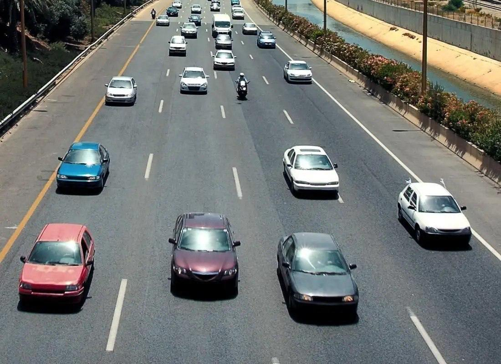
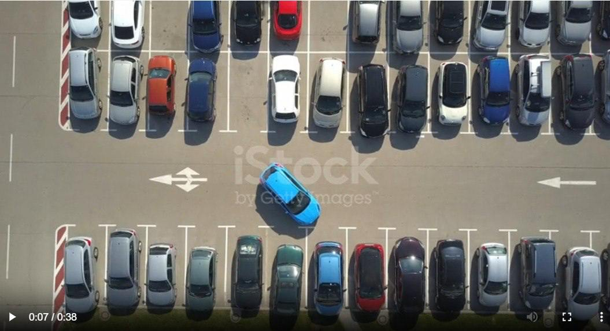
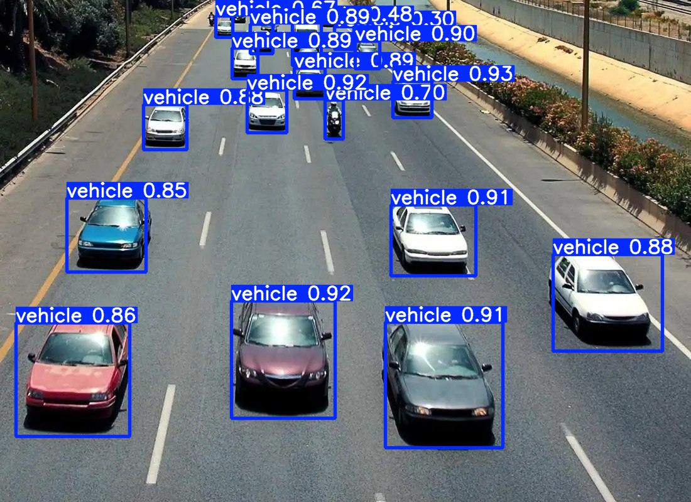
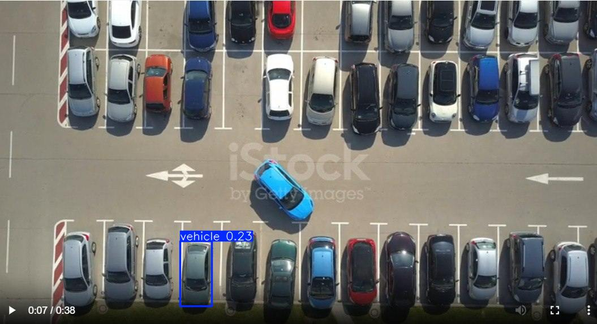

# README

## Motivation

Целью проекта является разработка системы трекинга автомобилей с использованием дрона. Для реализации и тестирования системы была выбрана видеоигра GTA5, так как она воссоздает трафик автомобилей, приближенный к реальному. Проект представляет собой первый шаг в разработке эффективной системы трекинга, и мы планируем продолжать его развитие в будущем.

## Introduction

Существует множество подходов для трекинга объектов на видео, включая глубокие нейронные сети, такие как YOLO, и классические методы, например, оптический поток. YOLO выделяется своей легковесностью и эффективностью при обнаружении объектов, что делает её подходящей для задач в реальном времени. Однако для более точной локализации объектов в динамических сценах требуется комбинированный подход, сочетающий детекцию и трекинг.

## Description

### Технический подход

Для обнаружения автомобилей была использована версия YOLOv8n, поскольку она является компактной, легковесной и оптимизированной для работы в реальном времени. Система устроена следующим образом:

- **Детекция**: YOLO применяется к каждому 10-му кадру видеопотока, чтобы определить расположение автомобилей.
- **Трекинг**: Между кадрами, обработанными YOLO, используется алгоритм трекинга для отслеживания объектов. Мы выбрали Norfair, так как он хорошо работает с большим количеством объектов и отличается высокой производительностью.

### Датасет

Для обучения модели был создан собственный датасет, включающий:

- **Размер обучающей выборки**: 6231 изображение.

- **Размер валидационной выборки**: 1558 изображений.

Датасет был собран вручную и аннотирован с помощью инструмента CVAT. Несмотря на ограниченный объем данных, датасет предоставил достаточно информации для обучения базовой модели. Тем не менее, мы осознаем необходимость его расширения и улучшения качества аннотаций. Ссылка на датасет доступна [здесь](#).

### Параметры обучения

Модель обучалась с использованием следующих параметров:
```python
model.train(
    epochs=30,          # Количество эпох
    batch=32,           # Размер батча
    imgsz=640,          # Размер изображения
)
```

### Инструменты

- **CVAT** для аннотации данных.
- **Ultralytics** для работы с моделями YOLO.
- **YOLOv8n** для детекции автомобилей.

## Demo

Ниже представлены примеры работы системы. На изображениях можно увидеть результат трекинга автомобилей.

### 1. Входные изображения:




**Пример результата:**





Некоторые кадры демонстрируют проблемы c детекцией автомобилей, связанные с ограниченностью датасета и недочетами в его аннотации. Тем не менее, система демонстрирует уверенное обнаружение и трекинг объектов в большинстве случаев.


### 2. Входное видео:

https://github.com/user-attachments/assets/4e844a2f-34a8-4e44-919d-ab8920cdeefa


**Результат:**

https://github.com/user-attachments/assets/0f9cf14c-bc7b-4029-8f8a-d0c23ec6396b


## Results

Система показала себя как эффективное решение для трекинга автомобилей:
- **Сильные стороны**:
  - Высокая производительность в реальном времени.
  - Точность обнаружения объектов благодаря использованию YOLO.
- **Слабые стороны**:
  - Ограниченность обучающего датасета приводит к ошибкам в сложных сценах.
  - На данный момент трекер не функционирует должным образом.

## Conclusions

В будущем планируется:
- Расширение и улучшение датасета для повышения точности системы.
- Перенести проект на реальный дрон, чтобы протестировать его в условиях реального мира.
- Обучить модель взаимодействовать с видеоигрой GTA5 для автоматического сбора данных и тестирования алгоритмов в различных сценариях.
- ...
- ...


